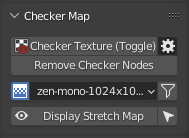
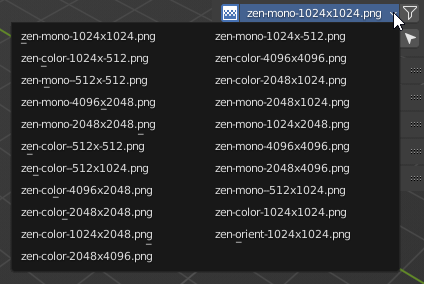
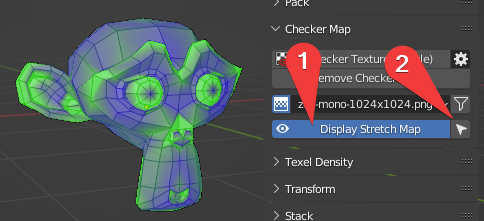

# Checker Map

!!! Info
    We would like to inform you that the documentation available on this web page pertains exclusively to Zen UV 3. However, we would like to emphasize that [**Zen UV 4 is now available and offers a significantly improved user experience**](https://zenmastersteam.github.io/Zen-UV/latest/).

    We also remind that Zen UV 3 users can [**Upgrade Zen UV 3 to Zen UV 4 with a discount!**](https://zenmastersteam.github.io/Zen-UV/latest/zenuv3_to_zenuv4/#upgrade-zen-uv-3-to-zen-uv-4-faq)

!!! Panel
    

    - The panel in 3D Viewport has a full set of features.

!!! Panel
    

    - The panel in the UV Editor has a minimal set of functions. And serves only to change the checker texture. This panel is disabled by default. You can turn it on in the addon settings.

### Checker Texture (Toggle) 

Add Checker Texture to the mesh (Toggle).

!!! Preferences
    

    - **Checker Library Folder** - Checker Library Folder indicates the folder with 
    which Zen UV Checker will work.
        All textures in * .JPG, * .PNG formats that are 
        inside this folder will be collected in 
        Checker Textures list and can be used to display 
        on selected models.
    - **Reset Folder** - Reset Checker Library path to Default State.
    - **Load Your Texture** - Open File Browser and add the selected texture to the Checker Library.
    - **Refresh Texture Library** - Refresh Textures from Checker Library Folder.
    - **Auto Sync Checker** - Automatically sync selected Checker Texture with Viewport.
    - **Open Shader Editor** - Open Shader Editor with Zen UV Checker Node.
    - **Reset Checker** - Reset Zen UV Checker to Default state.

### Remove Checker Nodes

- Remove Zen UV Checker Nodes from the scene materials.

### Checker Textures Selector

#### 1. Interpolation 

- Switch texture interpolation in the Checker Node between Linear and Closest.
  

#### 2. Checker Textures

- The Checker Textures field is used to select the checker texture that will be displayed on the selected models.
- A full list of default textures.

- Any texture can be tiled or offset but only in the Material Preview or Rendered modes.

- Every texture has an bright green pixel in U = 0, V = 0 coordinates.
- If you see green faces - keep in mind that they do not have UV coordinates.
  

#### 3. Filter 

- Enable resolution fields to filter existing textures by X or/and Y resolutions.
- Includes a Lock button for filtering square format textures.
- Includes an "O" button for activating Orient Checker texture.

- Orient filtering is on.
  

### Display Stretch Map

- Display an angle-based stretching map.

  1. Toggle displaying of the stretch map.
  2. Select stretched faces.